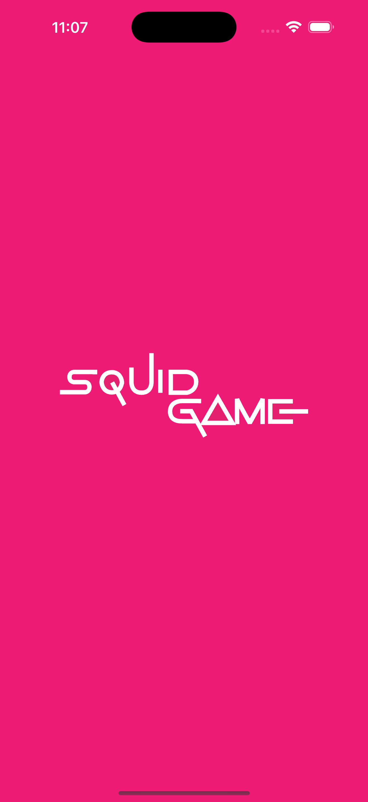

# Squid Game Flutter - Red Light Green Light

A Flutter implementation of the famous "Red Light Green Light" game from Squid Game. Test your reflexes and timing in this thrilling mobile game where you must move when the doll looks away and freeze when it turns around!

## Screenshots

  
  

## Features

- 🎮 Classic Red Light Green Light gameplay
- 🎭 Authentic Squid Game aesthetics
- 📱 Smooth animations and responsive controls
- 🏆 Win/lose scenarios with game over screen

## Getting Started

This project is a starting point for a Flutter application.

A few resources to get you started if this is your first Flutter project:

- [Lab: Write your first Flutter app](https://docs.flutter.dev/get-started/codelab)
- [Cookbook: Useful Flutter samples](https://docs.flutter.dev/cookbook)

For help getting started with Flutter development, view the
[online documentation](https://docs.flutter.dev/), which offers tutorials,
samples, guidance on mobile development, and a full API reference.

## How to Play

1. **Start the Game**: Tap to begin your journey
2. **Move Forward**: Use the move button to advance towards the finish line
3. **Watch the Doll**: When the doll turns around (red light), you must stop moving immediately
4. **Reach the Finish Line**: Successfully cross the finish line to win
5. **Don't Get Caught**: If you move during red light, it's game over!

## Installation

1. Clone this repository
2. Run `flutter pub get` to install dependencies
3. Launch the app with `flutter run`

## Built With

- Flutter - Google's UI toolkit for building natively compiled applications
- Dart - Programming language optimized for building mobile, desktop, server, and web applications
